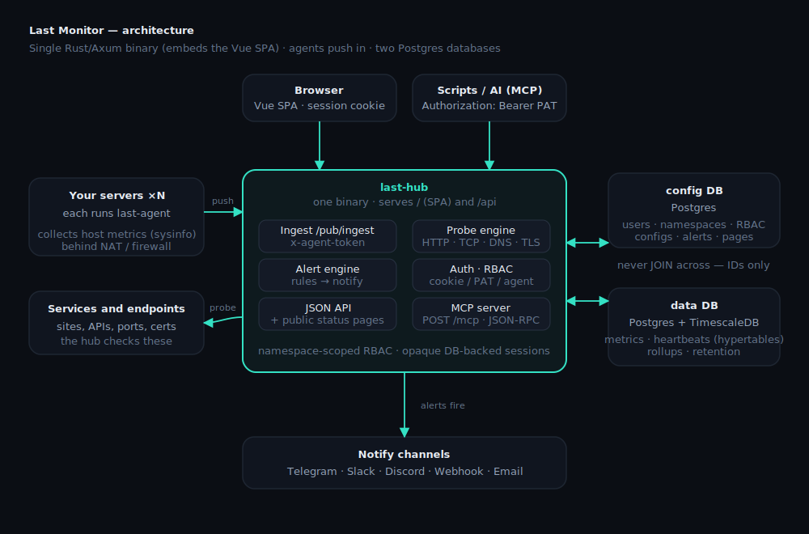

<!-- NAMING: the product display name is "Vantage" (Title Case) everywhere in
     the UI and docs. The slug "vantage" is only for repo / package / image
     names. Do not show "vantage" as a user-facing label. -->
<div align="center">


# Vantage

**Lightweight, self-hosted DevOps control plane — written in Rust.**

One place to **monitor, alert and operate** your infrastructure — servers, clusters,
services and cloud. Host metrics (an agent on every server) with a NewRelic-style fleet
overview, SSH/shell exec to act on a host, multi-user workspaces and RBAC — all served
from a **single Rust binary** that embeds the web UI. No Node, no `node_modules` at runtime.

</div>

---

## Why

- **One small binary.** The hub serves the JSON API **and** the web UI (a Vue SPA embedded
  into the binary). The whole repo is ~0.25 MB on GitHub; the agent and hub share one Rust
  workspace.
- **Push-based agents.** Agents reach out to the hub, so they work behind NAT/firewalls.
  One reusable **API key** can enroll a whole fleet (e.g. a Kubernetes DaemonSet) — hosts
  auto-register by hostname.
- **Time-series done right.** Metrics live in PostgreSQL + **TimescaleDB** hypertables, kept
  separate from the config database so the time-series store can be scaled independently.

## Features

**Fleet overview** — every host on one chart per metric (CPU / Memory / Disk / Network).
Hover a host to isolate its line across all charts, click to pin (multi-select), drag to
zoom a time range — selection and zoom window are kept in the URL (shareable). A powerful
search box filters both charts and tables: `web*`, `cpu>50`, `ws:production`, `kind:docker`.

**Host metrics** (agent) — overall CPU plus a **CPU breakdown** (user / system / iowait /
steal on Linux via `/proc/stat`; user / system on macOS via mach), **load average** (1m / 5m
/ 15m), memory, swap, disk usage, **disk I/O**, network throughput, uptime, temperature
sensors, NVIDIA **GPU** (usage / VRAM / power), and **per-container Docker stats**.

**Systems view** — nodes, Docker hosts (expand to their containers) and Kubernetes clusters
(expand to their nodes), with a workspace column, sortable columns, multi-select + bulk
delete, and an **Add system** wizard (binary / Docker / Compose / k8s DaemonSet).

**Per-system detail** — uPlot charts with a synced cursor, drag-to-zoom, interactive legends
and live updates (sub-hour ranges refresh every second). Charts always span the selected
window, leaving blank space when data is sparse.

**Services (uptime monitors)** — Uptime-Kuma-style checks: HTTP/HTTPS (status ranges,
keyword match, headers/body/auth, redirects), TCP, Ping, DNS, TLS-cert expiry, **Push**
(passive), and database probes — **PostgreSQL, MySQL, MongoDB, Redis, RabbitMQ**. Full
edit form, retries/flap guard, upside-down mode, and a **last request/response debug**
panel (with copy) for the most recent success and failure. A `Down` view lists only what's
currently failing.

**Alerting** — wire a source (host or service) → a condition → one or more **notify
channels**. 17 channel types (Telegram, Slack, Discord, Mattermost, Teams, Google Chat,
Matrix, ntfy, Pushover, Gotify, Bark, PagerDuty, Opsgenie, Twilio SMS, SMTP email, generic
webhook, Apprise) with a one-click test; fire on monitor-down or a host condition (offline,
CPU/memory/load), with an optional **re-notify cadence** while still firing. Channels are a
shared resource any workspace can attach. An **Events** feed records every fire/recover with
durations.

**Needs attention** — triage view that surfaces only abnormal hosts (down / high
CPU / memory / disk / disk-I/O), with per-workspace thresholds.

**API & automation** — a token-authed JSON API (**personal access tokens** under Settings)
and an **embedded MCP server** (`POST /mcp`) so AI assistants (Claude, etc.) can read and
operate the monitor with your RBAC. See [docs/API.md](docs/API.md).

**Admin & data** — a human-readable **audit log** (action + affected object), an **About**
page (version + update check), **data retention** tiers (TimescaleDB continuous aggregates +
retention policies), and **backup / restore** — download/upload or scheduled to
S3-compatible storage.

**Multi-tenant** — workspaces (k8s-style names), workspace-scoped RBAC plus a system
`admin`, opaque revocable cookie sessions (argon2), and a first-run wizard to create
the admin account. Reusable API keys enroll agents; deleting a key de-registers its hosts.

The sidebar groups everything into **Infrastructure**, **Services**, **Alert** and
**Settings** — click a parent to jump to its first page, hover the arrow to reveal its
sub-pages.

## Architecture

<p align="center"></p>

Agents **push** to the hub (`POST /pub/ingest`, per-server token) so they work behind
NAT/firewalls — the hub never connects back. The hub is a **single Rust binary** that also
**probes** your services and embeds the Vue SPA. Storage is **two separate PostgreSQL
databases** (config vs time-series on TimescaleDB), related only by IDs at the application
layer — **never JOINed** — so the time-series store can scale or relocate independently. The
agent ↔ hub wire types live in `crates/shared`. See [CLAUDE.md](CLAUDE.md) for the full design.

## Quick start (Docker Compose)

```bash
git clone <repo> && cd vantage
bash scripts/frontend.sh build        # build the embedded Vue SPA → frontend/dist (first run installs deps)
docker compose up -d --build          # Postgres/TimescaleDB + hub (:8080) + Adminer (:8088) + a bundled agent
```

Open **http://localhost:8080**. On first run you create the admin account (or set
`ADMIN_EMAIL` / `ADMIN_PASSWORD`). A bundled agent reports the Docker host out of the box.

> Want sizeable test data? `bash scripts/sim-agents.sh` spins up many simulated
> node / docker / k8s hosts pushing realistic metrics.

For **production** — Docker with published images, or **Kubernetes** via the Helm chart —
see the [deploy guide](deploy/README.md).

## Security

Security is the top design constraint. What protects a Vantage deployment:

- **Authentication** — opaque, revocable DB-backed **sessions** (httpOnly cookie; argon2id
  passwords). Programmatic callers use **PATs** (`Authorization: Bearer <token>`); agents
  authenticate per-request with a per-server `x-api-key`. **No open registration** — the first
  admin is bootstrapped from `ADMIN_EMAIL`/`ADMIN_PASSWORD`, then admins provision users.
- **Two-factor auth** (opt-in, per user — **Settings → Security**): an **authenticator app
  (TOTP)** — scan a QR with Google Authenticator / 1Password / Authy — and/or **passkeys
  (WebAuthn)** (Touch ID / Windows Hello / a security key). Sign-in then requires the second
  factor; one-time backup codes are issued. See [docs/auth-2fa-passkey.md](docs/auth-2fa-passkey.md).
- **Login throttle** — repeated failures lock the account for an escalating cooldown, so
  passwords and 2FA codes can't be brute-forced online.
- **Workspace-scoped RBAC** — `owner` / `editor` / `viewer` per workspace, plus a system
  `admin`. Shell/exec into a host additionally requires the `can_exec` capability.
- **Put the hub behind an auth gate.** Vantage authenticates every request, but you should
  still front it with **nginx basic-auth**, **Cloudflare Zero Trust**, or a **VPN** so the
  login page + `/api` aren't open to the internet — **allowing `/pub/*` through** for agents.
  Set `PUBLIC_URL`, then **Settings → Security → Public exposure → Check now** verifies it.
  See [docs/exposure.md](docs/exposure.md).

### SSH key encryption (`EXEC_APP_SECRET`)

Users' stored SSH private keys are protected with **envelope encryption**. Each user has
one random **master key** that seals their keys; the master key is itself wrapped in two
layers:

1. **inner — the user's password** (argon2id). The hub can unwrap a master key only while
   the user supplies their password (at login / console step-up). Changing a password only
   re-wraps the master key, so the user's keys keep working — no bulk re-encryption.
2. **outer — the application secret** `EXEC_APP_SECRET` (kept in env / a secrets manager,
   **never in the database**). A database leak therefore can't unwrap anything, even with a
   guessed password.

Set a high-entropy secret in production (omit it in dev → only the password layer applies,
and the hub logs a warning):

```bash
EXEC_APP_SECRET="$(openssl rand -base64 32)"   # 32 random bytes; store it safely!
```

> ⚠️ **Back up `EXEC_APP_SECRET`.** If you lose it, every user's master key (and thus their
> SSH keys) becomes undecryptable. Keep it in a secrets manager, not only in the DB host.

### Rotating the application secret

Rotation re-wraps only the **outer** layer of each master key — no user passwords are
needed. Run the hub binary's one-shot subcommand with both the new and old secret set:

```bash
EXEC_APP_SECRET="<NEW secret>" \
EXEC_APP_SECRET_OLD="<previous secret>" \
CONFIG_DATABASE_URL=… DATA_DATABASE_URL=… \
  vantage-hub rotate-app-secret          # or: bash scripts/rotate-app-secret.sh
```

It re-wraps every user to the new secret and prints how many were updated. Once it succeeds,
drop `EXEC_APP_SECRET_OLD` and restart the hub with only the new `EXEC_APP_SECRET`. (The same
command also **enables** the secret for the first time on an existing deployment.)

> An **admin password reset** can't recover a user's keys (the old password is unknown), so it
> mints a fresh master key and drops that user's stored SSH keys — they re-add them. A user
> changing **their own** password (with the old one) keeps their keys.

## Adding servers

In the UI: **Add system** → pick Node / Docker / Kubernetes → copy the install snippet. The
API key is managed for you. Run the agent anywhere; hosts appear automatically.

```bash
# Docker (reports host metrics via shared workspaces + mounts)
docker run -d --restart=unless-stopped --pid=host \
  -e HUB_URL=https://hub.example.com -e API_KEY=<api-key> -e DISK_PATH=/host \
  -v /:/host:ro -v /var/run/docker.sock:/var/run/docker.sock:ro \
  ghcr.io/<owner>/vantage-agent:latest
```

A **Helm chart** for the hub and a DaemonSet manifest for agents live in [deploy/](deploy/).

## Environment variables

### Hub (`vantage-hub`)

| Variable | Required | Default | Meaning |
|---|---|---|---|
| `CONFIG_DATABASE_URL` | ✅ | — | Postgres URL for the **config** DB (users, workspaces, RBAC, server/monitor config, alert rules, status pages). |
| `DATA_DATABASE_URL` | ✅ | — | Postgres **+ TimescaleDB** URL for the **data** DB (metrics & heartbeat hypertables). May point at the same instance early on. |
| `ADMIN_EMAIL` / `ADMIN_PASSWORD` | — | — | Bootstrap the first admin on startup if that user doesn't exist. After first login, provision users in the UI. |
| `EXEC_APP_SECRET` | — (prod: yes) | — | Application secret that wraps the **outer** layer of every user's SSH-key master key. **Set a high-entropy value in production** and back it up. Omitted → password-only protection + a startup warning. See [Security](#security). |
| `EXEC_APP_SECRET_OLD` | — | — | The previous `EXEC_APP_SECRET`, set **only during a rotation** so old rows can be re-wrapped (`vantage-hub rotate-app-secret`). |
| `PUBLIC_URL` | — | auto-detected from the request | The hub's externally-reachable base URL (e.g. `https://vantage.example.com`), used by the public-exposure self-check. Normally **auto-detected** from the request's `X-Forwarded-Proto`/`-Host` (or `Host`); set this only to override. |
| `WEBAUTHN_RP_ID` | — | derived from request `Origin` | Passkey relying-party ID — the **registrable domain** (e.g. `vantage.example.com`). **Optional**: left unset, it's derived per request from the browser's `Origin`, so passkeys work on whatever domain serves the hub. Set it (with `WEBAUTHN_ORIGIN`) only to pin one canonical RP. |
| `WEBAUTHN_ORIGIN` | — | derived from request `Origin` | Passkey origin(s) — full scheme+host the SPA is served from. **Optional** (see `WEBAUTHN_RP_ID`). Comma-separate to allow several (e.g. dev `http://localhost:5173,http://localhost:8080`). |
| `BIND_ADDR` | — | `0.0.0.0:8080` | Listen address. |
| `INSECURE_COOKIES` | — | `0` | Set `1` to drop the `Secure` flag on the session cookie (local **http** dev only). |
| `EGRESS_POLICY` | — | (allow private) | Set `strict` to also block private (RFC1918/ULA) outbound targets for probes / notify / backup (SSRF hardening). |
| `LOCAL_API_KEY` | — | — | If set, auto-creates a `default` workspace + a `local` server enrolled with this key (lets the bundled compose agent report out of the box). |
| `AUTO_UPDATE` | — | — | On the `:auto-update` channel under k8s, opt the hub into self-update. |
| `RUST_LOG` | — | `info,sqlx=warn` | Log filter (`tracing` / `env_filter`). |

> `GIT_SHA` / `VANTAGE_CHANNEL` are **build-time** args (set by CI, baked via `build.rs`) for the About page + auto-update channel — not runtime config.

### Agent (`vantage-agent`)

| Variable | Required | Default | Meaning |
|---|---|---|---|
| `HUB_URL` | ✅ | — | Base URL of the hub the agent pushes to (e.g. `https://vantage.example.com`). |
| `API_KEY` | ✅ | — | The per-server enrollment key (sent as `x-api-key`). The hub maps it to a workspace; hosts auto-register. |
| `INTERVAL` | — | hub-controlled | Optional push-cadence override (seconds). Normally the hub returns the next interval. |
| `ALLOW_SHELL` | — | **on** | The reverse SSH tunnel for the browser console. Set `0`/`false`/`no`/`off` to disable shell access from this host. |
| `HOSTNAME_OVERRIDE` | — | system hostname | The name this host reports as. |
| `AGENT_KIND` | — | auto | Force the agent kind (`node` / `docker` / `kubernetes`) instead of auto-detecting. |
| `CLUSTER` | — | — | Cluster label for grouping (Kubernetes). |
| `DISK_PATH` | — | `/` | Filesystem path to report disk usage for (use `/host` when mounting the host root into a container). |
| `NODE_NAME` | — | (k8s downward API) | The Kubernetes node name when running as a DaemonSet. |
| `AUTO_UPDATE` | — | — | Opt the agent into self-update on the auto-update channel. |

## Development

```bash
cargo build                  # whole workspace (hub + agent + shared)
cargo test                   # unit tests
cargo clippy --all-targets   # lint
cargo fmt                    # format

bash scripts/frontend.sh dev # Vite dev server on :5173 (HMR; proxies the API to :8080)
bash scripts/frontend.sh build  # produce frontend/dist embedded by the hub
HUB_URL=http://localhost:8080 API_KEY=<key> cargo run -p vantage-agent   # run an agent
```

During UI work use the Vite dev server (**:5173**) — it hot-reloads and is immune to hub
rebuilds. The hub serves the built SPA at **:8080**.

**Stack:** Rust + **Axum** (hub), **sysinfo + bollard** (agent), **sqlx** (runtime queries),
**PostgreSQL + TimescaleDB**, **Vue 3 + Vite + uPlot + Tailwind** SPA embedded via
`rust-embed`.

## Documentation

- [docs/](docs/README.md) — documentation index.
- [docs/API.md](docs/API.md) — HTTP API + MCP server reference (auth, endpoints, tools).
- [deploy/README.md](deploy/README.md) — install & deploy (Docker, Kubernetes/Helm, agents).
- [CLAUDE.md](CLAUDE.md) — architecture & engineering conventions.
- [CHANGELOG.md](CHANGELOG.md) — per-release changes.

## Roadmap

Service monitors (12 types), **multi-channel alerting** + events feed, the audit log,
TimescaleDB rollups + tunable retention, **backup/restore (S3, scheduled)**, and a
**token-authed API + embedded MCP server** are all **shipped**. Planned next: **web
SSH/terminal** into hosts and an **adaptive report interval** (realtime only while a host
is being viewed). See [docs/ROADMAP.md](docs/ROADMAP.md).

## License

MIT
